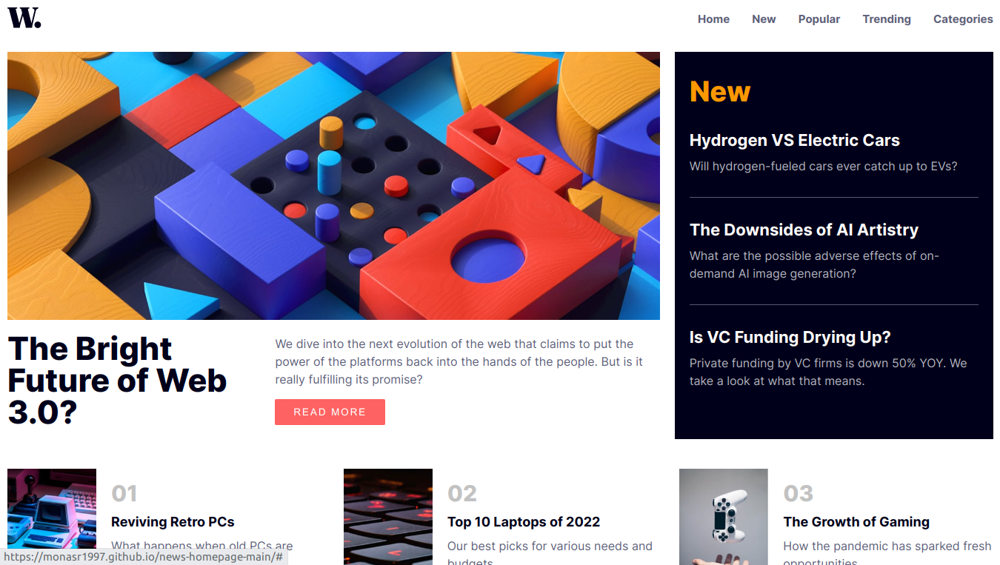
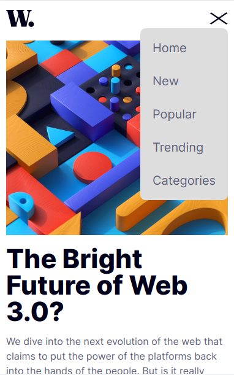

# Frontend Mentor - News homepage solution

This is a solution to the [News homepage challenge on Frontend Mentor](https://www.frontendmentor.io/challenges/news-homepage-H6SWTa1MFl). Frontend Mentor challenges help you improve your coding skills by building realistic projects.

## Table of contents

- [Overview](#overview)
  - [The challenge](#the-challenge)
  - [Screenshot](#screenshot)
  - [Links](#links)
- [My process](#my-process)
  - [Built with](#built-with)
  - [What I learned](#what-i-learned)
  - [Continued development](#continued-development)
  - [Useful resources](#useful-resources)
- [Author](#author)
- [Acknowledgments](#acknowledgments)

## Overview

### The challenge

This app can do:

- View the optimal layout for the interface depending on their device's screen size.
- See hover and focus states for all interactive elements on the page.
- Toggle the mobile menu

### Screenshot

### Links

- Solution URL: [GitHub](https://github.com/monasr1997/news-homepage-main)
- Live Site URL: [live site URL](https://monasr1997.github.io/news-homepage-main/)

## My process

### Built with

- Semantic HTML5 markup
- CSS Flexbox
- CSS Grid
- CSS media query
- Mobile-first workflow
- Java Script

### What I learned

- Toggle menu by javascript

### Continued development

### Useful resources

- [MDN web Docs](https://developer.mozilla.org/en-US/)
- [CSS tricks](https://css-tricks.com/)

## Author

- Website - [Mohamed Nasr](https://linkedin.com/in/monasr1997)
- Frontend Mentor - [@monasr1997](https://www.frontendmentor.io/profile/monasr1997)
- Twitter - [@monasr1997](https://www.twitter.com/monasr1997)

## Acknowledgments

- [MDN web Docs](https://developer.mozilla.org/en-US/)
- [CSS tricks](https://css-tricks.com/)
